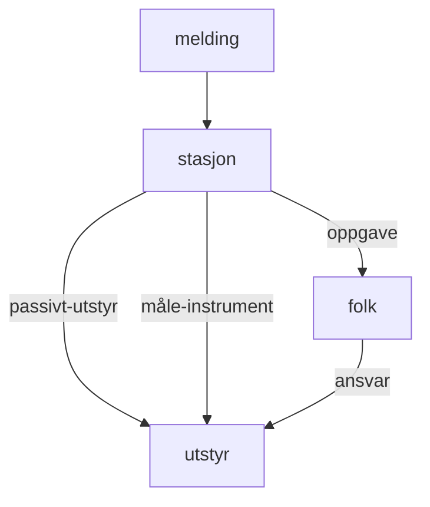

# Stinfosys, 2.linje 

## Systemskisse

### Datamodell




## Systemkomponenter
### Maskiner
Systemet kjører på linux maskiner.

### Backup
cronjobben $HOME/bin/db_backup/backup.sh kjøres en gang daglig
backupene legges under ~/db_backup

### Driftsovervåking
Denne består av 3 deler:

*  cronjobben $HOME/bin/dbdrift/dbdrift.sh kjøres to ganger daglig
*  cronjobben $HOME/bin/dbdrift/minpost.pl kjøres annenhver time på dagtid for å sjekke om databasen er nede
*  mail til mailadressene i MAILTO lista dersom noe går galt

cronjobben $HOME/bin/dbdrift/dbdrift.sh kjører to script:

 *  $HOME/bin/dbdrift/maxdisk.pl skriver ut advarsel når diskplassen igjen er mindre enn 80%
 *  $HOME/bin/dbdrift/maxpost.pl skriver at det sannsynligvis er for mange postmastere,  
    dette er et symptom på feil, men som regel er grensen satt for lavt. Systemet må sjekkes  
    om det er korrumpert og om vi står foran en ukontrollert økning i antall postmastere.

### Vedlikehold av databasen
cronjobben $HOME/bin/dbdrift/stinfosys_dbservice_cron kjøres en gang daglig

### Databasen
Selve databasen er en PostgreSQL database og kjører på egen virtuell server.
Se i git for beskrivelse av databasen:

https://gitlab.met.no/obs/stinfosys/blob/master/database/stinfosys_schema.sql

https://gitlab.met.no/obs/stinfosys/blob/master/database/stinfosys_schema.doc

### Environment
*  i .bashrc fila

==================================8←————————-

```
if [ -e ${HOME}/etc/xstinfosys.conf ]; then
   source ${HOME}/etc/xstinfosys.conf
else
   echo "FATAL: Kan ikke finne ${HOME}/etc/xstinfosys.conf"
fi

export LESSCHARSET=utf-8
```
——————→8=======================================

### Konfigurering
~/etc/stinfosys.conf
se ~/src/stinfosys/doc/system/konfigurering.txt for hvordan konfigureringsfilen skal konfigureres

### cgi-script
Disse ligger under ~/cgi-bin/GUI for registreringsgrensesnitt og ~/cgi-bin/hovedkopi for hovedkopi

### perl-moduler
Disse ligger under ~/lib/perl
Her installeres både perlmoduler i forhold til hver tabell og generelle hjelpemoduler for systemet som helhet

### templates
Disse ligger under ~/metno/stinfosys/templates
Templatene fungerer som en gui-mal for dynamisk generering av html kode fra databaseinnhold

### Administrasjonsscript
Alle administrasjonsscript er knyttet til drift av databasen se punktene

  * Driftsovervåking
  * Vedlikehold av databasen

## Tilganger
For å få opp informasjon om telefonnummere i hovedkopi så må det være lagt inn en rad om en person tabellen. Dette er viktig for drift av stasjonsnettet.

## Driftsrutiner

    Oppgradering/tilbakerulling med oppskrift

## Feilhåndtering av 2.linje: Webapplikasjonen, ikke database ( datase se nedenfor )

Se første linje dokumentasjon.
Bildene i hovedkopi vises ikke

Logg inn på stinfosys@stinfosys og sjekk at mountingen til lustre er som den skal vha: df -h. Sjekk linjen som begynner slik:
<code>
  //cifs-int-gw-b.met.no/storeB/project/met-obs/stinfosys
</code>

Deretter
<code>
  ls  /vol/stinfosys-cifs
</code>

Er det problemer der ( er tom eller viser bare rare tegn ) så gå inn på en tilgangsmaskin til lustre(xvis-m3a) og sjekk at /lustre/storeB inneholder data

Dette utføres: Først logge seg inn på en tilgangmaskin til lustre ( fra egen maskin ): 
<code>
ssh -Y xvis-m3a
</code>

Deretter sjekk at /lustre/storeB inneholder data:
<code>
ls /lustre/storeB
</code>

Er dette OK og det fortsatt er problemer kunne en sjekke om linkene er i orden:

```
cd ~/htdocs
~/htdocs$ ls -ltr | grep '/vol/stinfosys/'
lrwxrwxrwx 1 stinfosys stinfosys    40 Mar  5  2015 certificat -> /vol/stinfosys/share/metadata/certificat
lrwxrwxrwx 1 stinfosys stinfosys    39 Mar  5  2015 miniature -> /vol/stinfosys/share/metadata/miniature
lrwxrwxrwx 1 stinfosys stinfosys    42 Mar  5  2015 station_info -> /vol/stinfosys/share/metadata/station_info
lrwxrwxrwx 1 stinfosys stinfosys    50 Mar  5  2015 certificat-miniature -> /vol/stinfosys/share/metadata/certificat-miniature
lrwxrwxrwx 1 stinfosys stinfosys    48 Mar  5  2015 fileinputstinfosys -> /vol/stinfosys/share/metadata/fileinputstinfosys
```

Er linkene der burde alt være OK. 

## Feilhåndtering av 2.linje: Database

#### Starte og stoppe databasen
```
pg_ctlcluster 9.6 main start
pg_ctlcluster 9.6 main stop
```

#### Opprette tom stinfosys database

les [Database](database.md)

#### Førstehjelp ved korrupt database

En må først prøve å restarte databasen, det kan gjøres ved å stoppe og starte databasen.
Strengt tatt så er det databaseclusteret en restarter og ikke databasen.
Dersom databasen har av forskjellige grunner hengt seg opp må en bruke:
```
$ ps --user=stinfosys | grep postmaster
$ kill -9 "tall lengst til venstre"
```
Nå kan en prøve å starte databasen. Dersom dette ikke går står en ovenfor en mye mer omfattende oppgave:
Databaseclusteret må installeres på nytt, les [Database](database.md).
Ellers så er det bare å fortsette nedenfor:
```
$ dropdb stinfosys
$ createdb -E UTF8 stinfosys "Produksjons-database for stinfosys"
```
##### Legge tilbake backup som er OK

Forutsetter at det finnes en tom stinfosys database som er opprettet. 
```
$ cd /metno/stinfosys/db_backup
```
Finn siste backup ( siste backup er den med dato nærmest nåtiden.)
```
$ gunzip siste_backup.gz
$ psql stinfosys < siste_backup
```
eks.
```
$ gunzip stinfosys.2006-08-14.gz
$ psql stinfosys < stinfosys.2006-08-14
```
Advarsel: Det er ikke alltid siste backup er den riktige å bruke,
se vurderinger av backup nedenfor 

### Vurderinger av backup

Finn siste backup som er OK Kriterier for OK:
  * backupen må være hel.
  * siste backup som ikke er mye kraftig mindre/større enn forrige backup.
  * bacupen hentes fra før tidspunktet som databasen begynte å oppføre seg underlig.

Eksempler på underlig oppførsel eller årsaker til det:

  * mange psql demoner genereres tilsynelatende uten grunn.
  * disken har gått full.
  * en sektor på disken er korrumpert
  * diskkrasj
  * databasen ble tatt ned på en for hard måte, f.eks. ved overgangen fra en maskin til en annen.

### Driftsovervåking ( av databasen )

MAILTO=«oystein.lie@met.no,terje.reite@met.no»
Dette består av to typer aktiviteter:

  * følge med på innkommende advarsler på mail, se nedenfor
  * sette opp filteret på sin mailklient til å kunne filtrere mail i et warningfilter som en sjekker regelmessig, denne aktiviteten er beskrevet under [Database](database.md).

Hvilke advarsler gis:

  * advarsel når diskplassen igjen er mindre enn 80%
  * advarsel at det sannsynligvis er for mange postmastere,
    dette er et symptom på feil, men som regel er grensen satt for lavt. Systemet må sjekkes
    om det er korrumpert og om vi står foran en ukontrollert økning i antall postmastere.
  * advarsel at det er for få postmastere, databasen er sannsynligvis nede

### Opprydding når disken har gått full eller krasjet

Er det fullstenfig diskkrasj må en installere systemet på nytt, les 
[Database](database.md).

Har disken gått full har en 4 valg:

  * Få mere diskplass
  * Slette unødvendige filer, sannsynligvis ikke noe særlig langvarig løsning for vårt system,

men det kan gi verdifullt pusterom

  * flytte hele systemet til ny maskin/bruker, les [Database](database.md)
  * flytte databasen til ny maskin/bruker, se nedenfor

Nedenfor er det en kort gjennomgang over å flytte databasen til ny maskin/bruker; utfør følgende punkter under [Database](database.md):

  * Forutsetninger som må være tilstede før en genererer databasen
  * Sjekke ut kildekoden fra versjonskontrollsystemet
  * Installere initdb
  * Installasjon og konfigurering av system-config
  * Installasjon av systemet

  * Installere en tom database
  * Brukere og passord (gjøres i psql klienten )
  * Bygge opp innholdet i databasen fra bacup
  * Oppdatere cron-tabellen til å håndtere service script for drift av databasen.
  * Environment

    Til slutt må en tilbake på modermaskinen der cgi-scriptene er og endre i fila stinfosys.conf:
```
    $ 'vim eller emacs' $HOME/etc/stinfosys.conf 
```
    Rediger verdiene i fila stinfosys.conf hvor den nye databasen ligger 

## Kjente feil
## Ressursbruk
  * Normaltilstand for diskbruk, minne ol.

## Installasjonsprosedyrer
### Installasjon
#### For å installere webapplikasjonen:
[Installasjon](installasjon.md)

#### For å installere databasen:
[Database](database.md)

#### Vi trenger en backup-server som er i et annet datarom enn databasen, for å installere denne:
[Backup](backup)

#### Distribusjon av stinfosys databasen stinfodb til externe kopier i Ares extern:
[Stinfodb distribusjon](stinfodb-distribusjon)
#### Hovedkopi bildene:

nfs-stinfosys er en server som fungerer som nfs-server for diskområdet /vol/stinfosys.
Hovedkopi bildene er lagret der. nfs-stinfosys er satt opp vha. Chef.
Oppgraderinger

## Oppgraderinger
[Oppgraderinger](oppgraderinger)

## Egne tilpasninger
  * Bygging, patching
  * Installasjon/distribusjon (eks https://dokit.met.no/sysdok/rutine/oppsett)

## Undersider
  Se på oversikten til høyre

## Tips/triks
## Backup/Restore

Må ta backup til tape av disse filområdene:

På selve maskinen stinfosys ta backup til tape av dette filområdet: /vol/stinfosys-lustre-nfs
Tilsvarer følgende diskområde på lustre: lustre-int-gw-b.met.no:/lustre/storeB/project/met-obs/stinfosys


Bacupsystemet kjører på maskinen stinfodb-backup ( i datarom b ).
På maskinen stinfodb-backup ta backup til tape av dette filområdet:

    /var/backups/db_backup/stinfosys

## Test/stagingoppsett

## Fra produktfiler i stinfosys til tabeller i Kdvh
Det overføres fra stinfosys filer som representerer tabeller som er en ren kopi av det som er i stinfosys og filer som er produkter. Når det gjelder rene datadumpfiler fra stinfosys så kan folk heller hente det samme i stinfosys.

Når det gjelder disse produktene så er ikke det tilfellet, de finnes ikke i stinfosys databasen.
Vi gjør følgende:
  * Produksjonen av disse produktene opprettholdes.
  * Overføringen til klima av disse produktene stanses når KDVH slås av.
  * Vi tilgjengeliggjør ikke disse produktene som filer fordi vi vil se det reelle behovet. Folk må faktisk klage på at det er noe de ikke får.

For de produktfilene som lages på stinfosys og tilsvarende tabeller i kdvh:
<code>
st_amsl.out --> temp_st_amsl --> t_st_amsl
st_coordinate.out --> temp_st_coordinate --> t_st_coordinate
st_hp.out  --> temp_st_hp  --> t_st_hp    
st_info.out --> temp_st_info --> t_st_info
st_municipality.out --> temp_municipality --> t_municipality
ST_TYPES.out --> temp_st_type_base--> t_st_type_base--> t_st_type
ST_TYPES_MESSAGE.out --> temp_st_type_message_base --> t_st_type_message_base
st_wmo.out --> temp_st_wmo --> t_st_wmo
</code>
Fra *.out filer til temp_* tabeller brukes *.ctl filer og sqlloader
Fra temp_* tabeller til t_* tabeller brukes triggere.

Et eksempel på en ctl fil for st_amsl:
<code>
[metaklima@shimmer ~]$ cd bin/stkl_produkter
[metaklima@shimmer stkl_produkter]$ cat st_amsl.ctl
load data
INFILE '$HOME/stinfosysprodukter/st_amsl.out'
replace
into table temp_st_amsl
fields terminated by "|"
(stnr,fdato date "YYYY-MM-DD",tdato date "YYYY-MM-DD",amsl)
</code>
